# cool-admin-react

> React + AntD 版 cool-admin 管理端前端 —— **协议层 100% 兼容、后端零改动**。
> 与 [cool-admin-nest](https://github.com/desperado-zhang/cool-admin-nest) 的 Vue 版管理端（apps/admin-ui）行为一致、**可插拔替换**。

## ✨ 项目亮点

- **协议兼容**：对外协议（URL/出入参/响应包装/错误码/EPS/401-403 语义）与 cool-admin 完全一致，接口契约唯一图纸为 `../cool-admin-nest/AGENTS.md` + `docs/eps.snapshot.json`
- **EPS 驱动**：构建期注入 EPS（vite 虚拟模块，对应 @cool-vue/vite-plugin），`service.base.sys.user.page(...)` 风格全量生成 20 前缀/119 接口，后端加接口 `pnpm eps` 重建即可
- **配置式 CRUD**：自研 CoolTable / CoolForm / CoolDialog（对应 cl-crud），页面按 Vue 版列配置一一移植
- **完整权限体系**：RBAC 按钮级权限（对应 v-permission，超管豁免），越权请求 403
- **token 生命周期**：401 单飞 refreshToken 续期重放 / 改密旧 token 失效 / logout 立即作废
- **Docker 可插拔替换**：一条 compose 命令替换 Vue 版 ui 容器

## 🚀 快速开始

### 方式一：Docker 部署（可插拔替换 Vue 版）

```bash
# 1. 启动 cool-admin-nest 全家桶（MySQL + Redis + API + Vue UI）
#    见 cool-admin-nest README：docker compose up -d --build

# 2. 用 React 版替换 ui 容器（在 cool-admin-nest 目录执行）
docker compose -f docker-compose.yml -f ../cool-admin-react/docker-compose.react.yml up -d --build ui

# 3. 访问
前端: http://localhost:9000   (admin / 123456)

# 恢复 Vue 版
docker compose -f docker-compose.yml up -d --build ui
```

### 方式二：本地开发

```bash
# 1. 启动后端（cool-admin-nest，API localhost:8001，账号 admin/123456）
#    docker compose up -d   —— 见 cool-admin-nest README

# 2. 安装依赖
pnpm install

# 3. 开发（localhost:9001，/admin 代理到 8001）
pnpm dev

# 4. 构建（先拉取后端 EPS 再编译；后端加接口须重新构建 bundle）
pnpm build

# 仅重新生成 EPS 类型（后端接口变更后）
pnpm eps
```

## 📦 已实现功能

与 Vue 版一致的 **17 页面**：

| 模块 | 页面 | 说明 |
|---|---|---|
| base | 登录 | 验证码 svg/base64 + 记住用户名 + 已登录回跳 |
| base | 工作台 | 统计卡片 + echarts 图表（P2 静态演示页对齐） |
| base | 用户管理 | 组织架构树（右键增改删/拖拽排序）+ 部门过滤 + 角色分配 + 单个/批量转移 |
| base | 角色管理 | 菜单勾选树（功能权限）+ 部门勾选树（数据权限） |
| base | 菜单管理 | 树形表格 + 图标/上级节点选择 + 导入导出 JSON + 刷新同步侧边菜单 |
| base | 部门管理 | 树形 + 拖动排序（department/order） |
| base | 参数配置 | 三种数据类型（字符串/富文本 wangEditor/文件上传） |
| base | 操作日志 | 清空 + 日志保存天数 + keyword 搜索 |
| base | 个人中心 | 头像上传 + 昵称 + 修改密码（personUpdate） |
| dict | 字典管理 | 类型列表 + 数据树形表格 + 字典缓存联动 |
| recycle | 数据回收站 | 批量/单行恢复 |
| space | 云空间 | 分类 + 文件网格 + 上传/多选删除/预览 |
| task | 定时任务 | 卡片列表 + cron/间隔联动表单 + 启停/立即执行 + 执行日志 |
| user | 用户模块 | 端用户信息 CRUD（性别/登录方式/状态字典） |
| helper | 插件市场 / AI 编码 | 插件分页列表；coding 模块树 + 代码生成 |
| demo | CRUD 示例 | demo.goods 完整 CRUD 演示 |

## 🏗 前端架构

```
┌───────────────────────────── 前端 cool-admin-react ────────────────────────────┐
│  React 18 + AntD 5 + react-router v6 + zustand + Vite 6 + TypeScript           │
│  ├─ 登录后拉取 permmenu（扁平数组）→ deepTree 组树 + filter(type==1) 动态路由    │
│  ├─ EPS 构建期注入（virtual:eps）→ 动态生成全部 service 层                      │
│  ├─ CoolTable/CoolForm/CoolDialog 配置式组件渲染所有管理页（对应 cl-crud）       │
│  └─ usePermission/<Permission> 按钮级权限（对应 v-permission，超管豁免）         │
└─────────────── HTTP 协议层（与 cool-admin 100% 兼容） ────────────────┘
                                │
                  { code: 1000/1001/1002/1003 } 统一包装
                  401 单飞续期重放 / 403 无权限语义
                                │
┌───────────────────────────── 后端 cool-admin-nest ─────────────────────────────┐
│  NestJS 11 + TypeORM + MySQL 8 + Redis（一期全量完成，零改动）                   │
└────────────────────────────────────────────────────────────────────────────────┘
```

### 核心框架 `src/cool`

- **service**：axios 契约拦截器（响应包装解开/401 续期/403）+ EPS 服务层（构建期注入）
- **crud**：CoolTable / CoolForm / CoolDialog / 组件注册表（el-input、cl-select、cl-switch、cl-upload、cl-editor 等 20+ 组件）+ 工具栏组件
- **store**：user（token 生命周期）/ menu（permmenu 组树+动态路由）/ process（页签+keep-alive）/ dict（字典缓存）/ app（折叠/全屏/暗色）
- **router**：动态路由（menus → routes）+ view-loader（viewPath → React 组件 / iframe / 占位页）
- **keep-alive**：react-activation 按路径缓存页面状态，关闭页签即释放

### 页面与 Vue 版一一对应

`src/modules/{base,demo,dict,helper,recycle,space,task,user}` 与 Vue 版 `src/modules` 镜像；菜单 viewPath（如 `modules/base/views/user/index.vue`）自动映射到 React 组件文件，后端菜单数据零改动即可点亮全部页面。

## 📸 功能截图

### 登录与工作台

| 登录 | 工作台 |
|---|---|
| 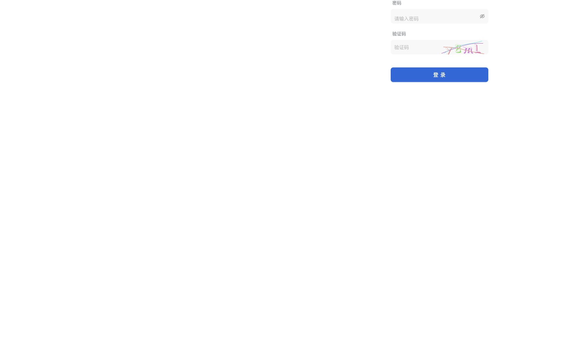 | 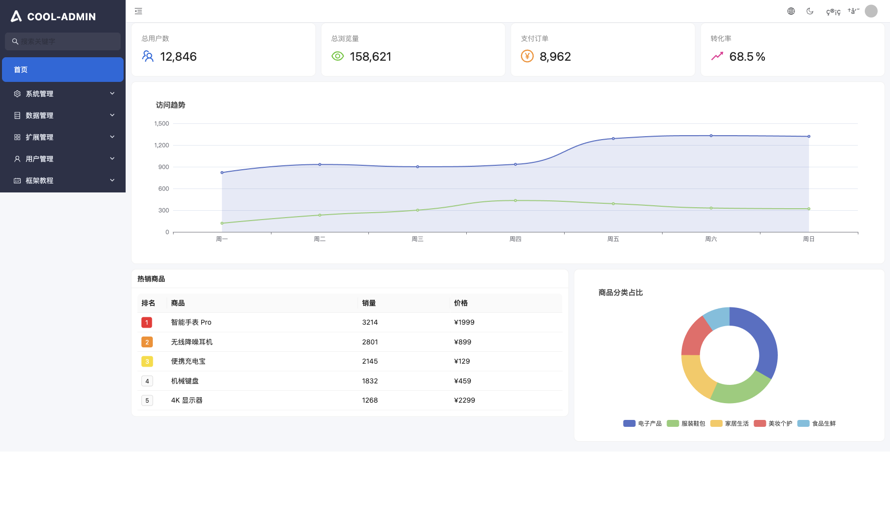 |

### 系统管理

| 用户列表 | 菜单列表 |
|---|---|
| 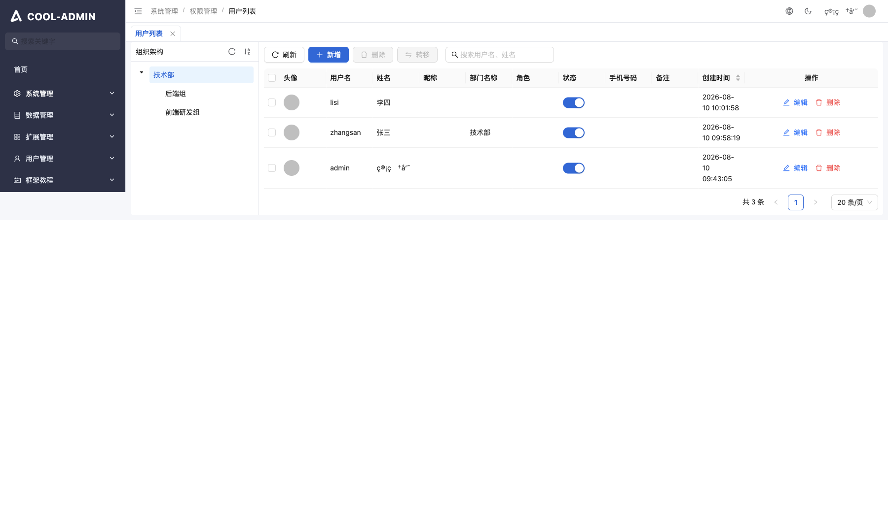 | 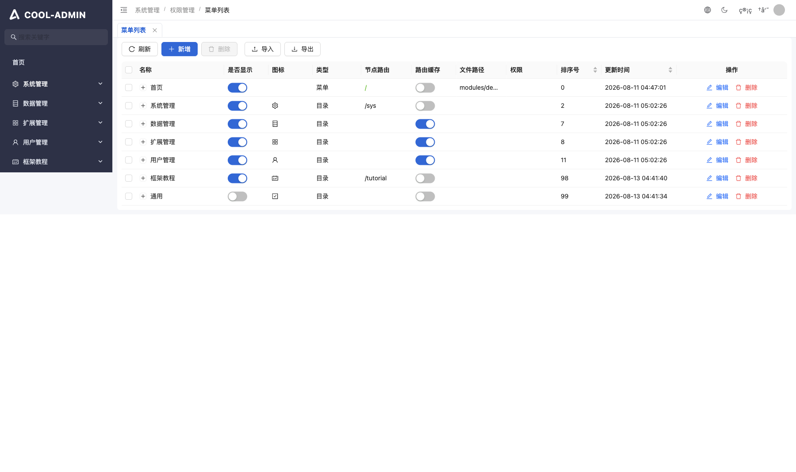 |

| 角色列表 | 参数配置 |
|---|---|
| 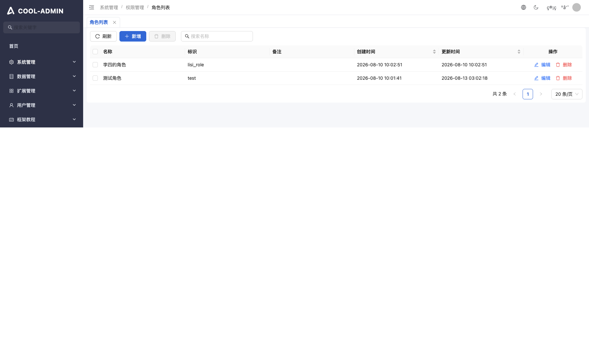 | 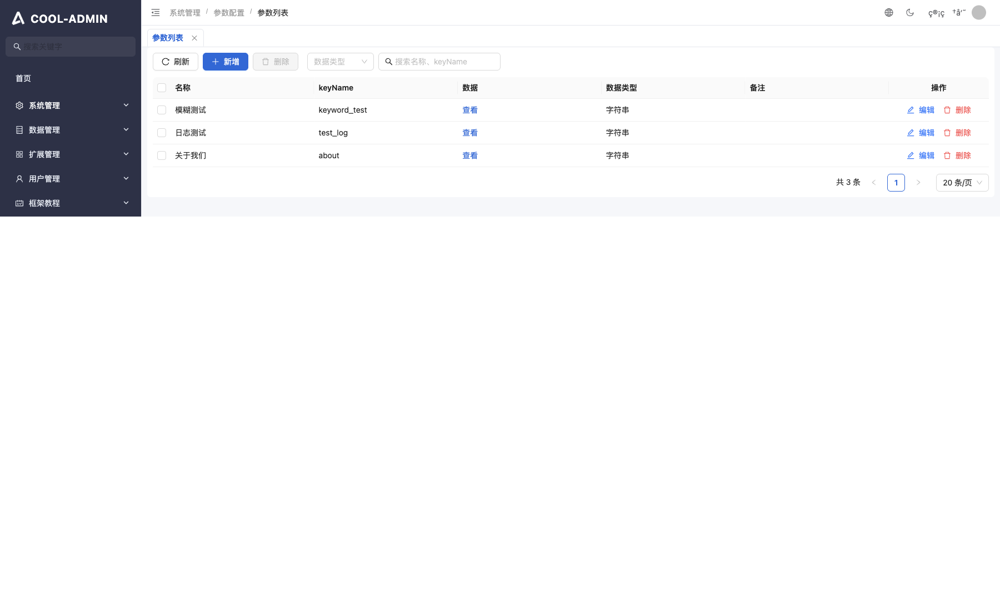 |

| 请求日志 | 任务列表 |
|---|---|
| 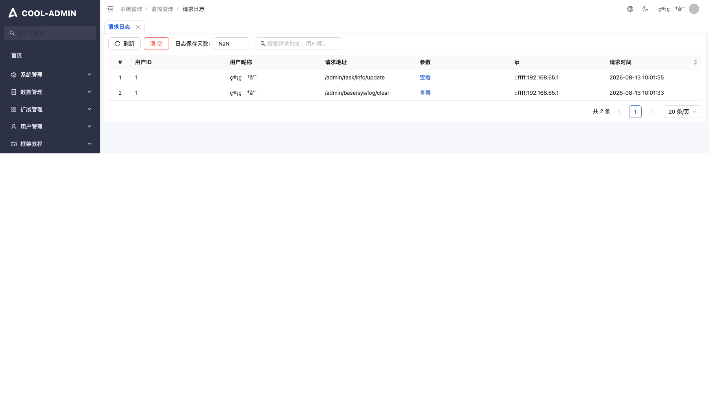 | 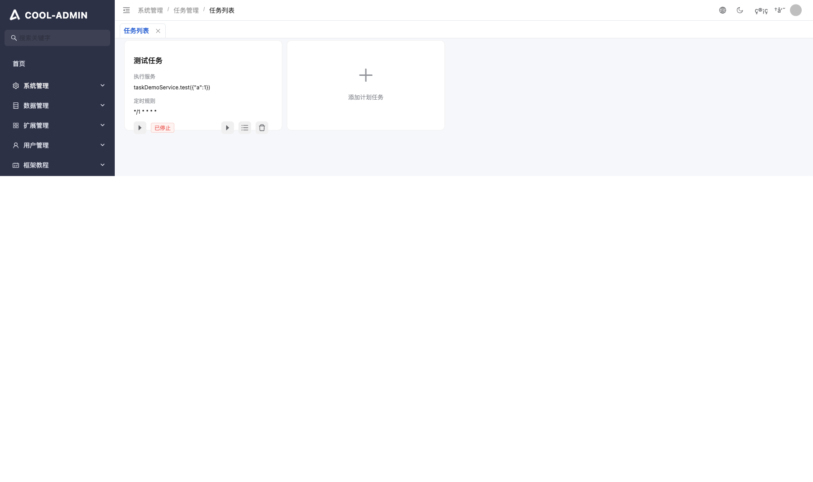 |

### 数据管理

| 字典管理 | 文件管理 |
|---|---|
| 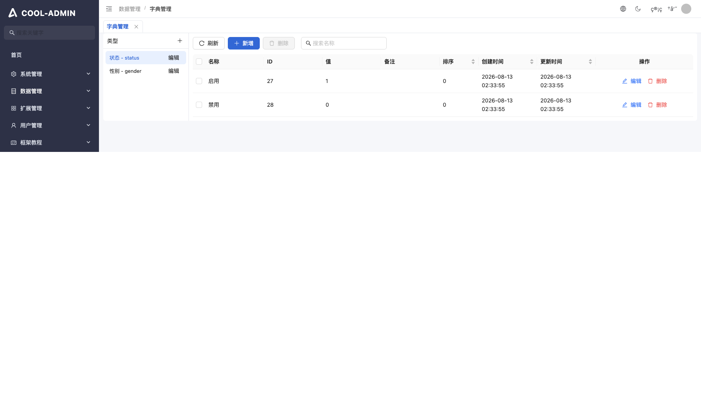 | 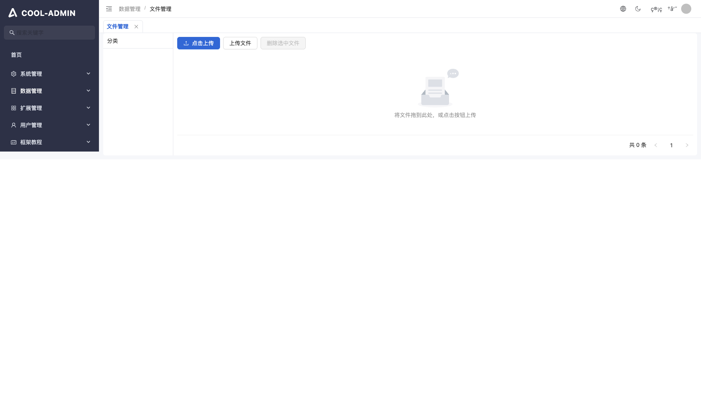 |

### 其他

| 数据回收站 | 用户中心 |
|---|---|
| 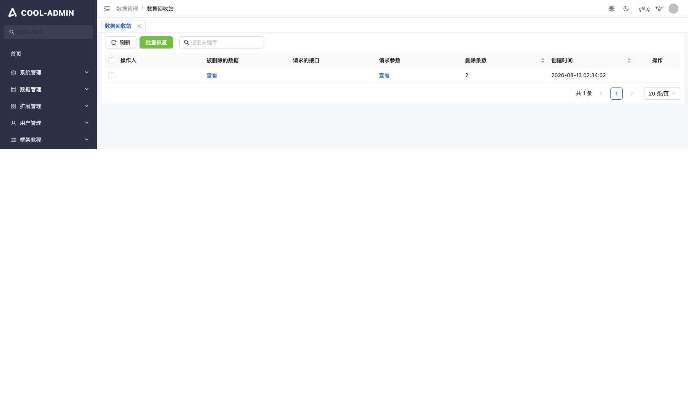 | 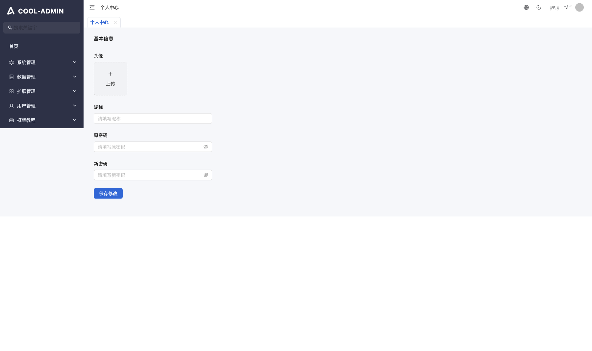 |

## 📁 目录结构

```
cool-admin-react/
├── AGENTS.md                    # 施工约定（接口契约唯一图纸指向 cool-admin-nest）
├── PROGRESS.md                  # 实施进度追踪（任务/待确认项/决策/验收记录）
├── Dockerfile                   # 前端镜像（多阶段构建 + nginx 反代）
├── nginx.conf                   # /admin 反代 api:8001
├── docker-compose.react.yml     # 可插拔替换 Vue 版 ui 容器的 compose override
├── build/
│   ├── eps/                     # EPS 生成器 + vite 插件（构建期注入）
│   └── cool/eps.json            # EPS 种子缓存（离线构建兜底）
├── scripts/gen-eps.mjs          # pnpm eps 重新生成 EPS 类型
├── docs/screenshots/            # 功能页面截图
└── src/
    ├── cool/                    # 核心框架
    │   ├── service/             # axios 契约层 + EPS 服务层
    │   ├── crud/                # CoolTable/CoolForm/CoolDialog/注册表/工具栏
    │   ├── store/               # zustand（user/menu/process/dict/app）
    │   ├── router/              # 动态路由 + view-loader
    │   ├── hooks/               # usePermission 等
    │   ├── components/          # 通用组件 + 菜单图标映射
    │   ├── utils/               # deepTree/storage 等
    │   └── types/               # 契约类型 + EPS 生成类型
    ├── config/                  # 环境配置
    ├── locales/                 # zh-CN / en-US（i18next）
    └── modules/                 # 页面模块（base/demo/dict/helper/recycle/space/task/user）
```

## 🛠 技术栈

| 层 | 技术 |
|---|---|
| 构建 | Vite 6 + React 18 + TypeScript |
| UI | AntD 5 + @ant-design/icons（暗色主题支持） |
| 路由 | react-router-dom v6（permmenu 动态路由） |
| 状态 | zustand |
| 请求 | axios（契约拦截器） |
| CRUD | 自研 CoolTable / CoolForm / CoolDialog（对应 cl-crud） |
| i18n | i18next + react-i18next（zh-CN / en-US） |
| 富文本 | wangEditor |
| 缓存 | react-activation（页签 keep-alive） |
| 图表 | echarts + echarts-for-react |
| 部署 | Docker + Nginx |

## 📐 核心契约

```
协议层（与 cool-admin 完全一致）
├── 统一响应：{ code: 1000, message: "success", data }（1001/1002/1003）
├── 异常：HTTP 200 + 业务码；token 失效 HTTP 401 + 登录失效~
├── token 生命周期：401 → refreshToken 单飞续期 → 重放原请求
└── 权限：perms 扁平数组 + 超管豁免（username === 'admin'），越权 403

前端关键契约
├── permmenu：menus 为扁平数组 → deepTree 组树 + filter(type==1) 生成路由
├── EPS：构建期注入，service.base.sys.user.page() 全量生成
└── 页面：viewPath 映射 React 组件，后端菜单数据零改动
```

## 📖 文档

- `AGENTS.md` — 施工约定（技术栈/目录/验收标准 + 前端关键契约红线）
- `PROGRESS.md` — 实施进度（任务 W0-W4/P、决策 D1-D5、验收记录）
- `../cool-admin-nest/AGENTS.md` — API 契约规范（10 章 + 3 附录，唯一施工图纸）
- `../cool-admin-nest/docs/eps.snapshot.json` — 官方 EPS 快照（验收基准）

## ✅ 验收状态

| # | 验收项 | 状态 |
|---|---|---|
| 1 | 登录 → permmenu → 动态路由 → 17 页面全部渲染 | ✅ 浏览器逐页实测 |
| 2 | 接口出入参与 cool-admin-nest AGENTS.md 一致 | ✅ 契约接口 68 个实测覆盖 100%，零 4xx/5xx |
| 3 | 按钮级权限：非超管仅见有权按钮，越权请求 403 | ✅ 新建角色/用户实测 |
| 4 | token 生命周期：401 续期重放 / 改密失效 / logout 作废 | ✅ HTTP 实测 |
| 5 | EPS 消费正确：service 层全量生成无遗漏 | ✅ 20 前缀与官方快照一致 |
| 6 | Docker 可插拔替换 admin-ui 容器 | ✅ compose override 实测替换并恢复 |

## License

- MIT（本项目）
